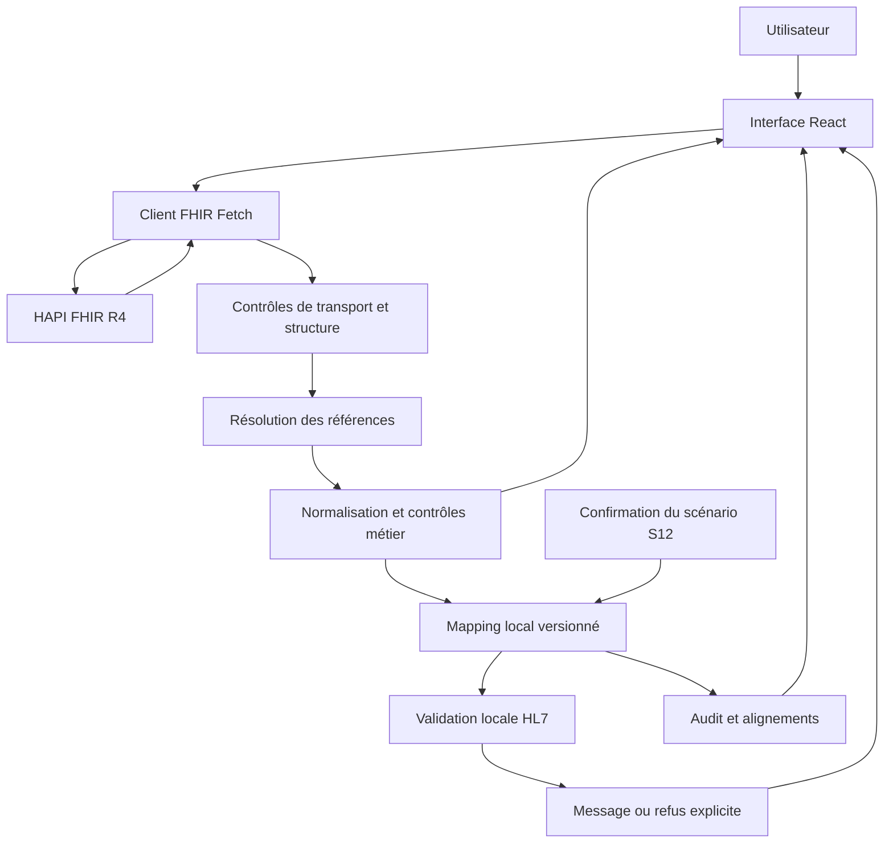

# Architecture et décisions

## Chaîne applicative

`hl7Mapper.ts` ne dépend pas des types FHIR. L’interface ne concatène aucun JSON FHIR en chaîne HL7. Le modèle intermédiaire conserve la provenance des identifiants, concepts, noms et durées.

## Accès FHIR

- Métadonnées obligatoires : version exacte `4.0.1`, contexte `rest.mode=server`, déclaration du paramètre `Appointment.patient`.
- Recherche patient : `name`, `identifier` ou lecture `Patient/{id}` ; critères encodés avec `URLSearchParams`.
- Recherche rendez-vous : `Appointment?patient=Patient/{id}`. Tous les rendez-vous retournés sont consultables, avec filtres locaux sur les pages chargées.
- `_include=Appointment:actor` utilisé lorsqu’annoncé. Résolution unitaire si la ressource manque dans le Bundle.
- Découverte facultative : rendez-vous `booked` → patients présents dans les ressources incluses ou lus par référence. Aucun identifiant de démonstration dans l’application.
- Pagination via le lien fourni par le serveur, y compris une URL HAPI au niveau `/baseR4?_getpages=…` sans slash final.
- HTTP même hôte mis à niveau vers HTTPS si la base configurée utilise HTTPS. Autres origines et chemins hors base refusés, y compris dans la pagination. Les références externes restent signalées.
- Références contenues `#id` résolues dans leur propriétaire ; références `urn:` résolues uniquement si leur `fullUrl` figure dans le Bundle. Une référence historique ne récupère pas silencieusement une version courante.
- Timeouts de 18 secondes, annulation lors d’un changement de contexte et bouton de reprise. Les recherches sans résultat restent distinctes d’un incident technique.

## Ressources et limites de résolution

Patient et Appointment sont les ressources centrales. Practitioner, PractitionerRole, Location, HealthcareService et Organization enrichissent le détail.

Un lieu déclaré dans PractitionerRole décrit un contexte d’exercice possible. Sa présence ne prouve pas qu’il est le lieu de ce rendez-vous : seuls les lieux directement participants alimentent AIL. La même prudence s’applique aux services du rôle. L’organisation du rôle est affichée sans être reconstruite en établissement HL7.

RelatedPerson et Device ne sont pas exportés : avertissement de perte. Une référence facultative indisponible ne rend pas le patient ou le rendez-vous inutilisable. Une `modifierExtension` ou des règles implicites non interprétées bloquent la conversion.

## Validation

1. **Transport/syntaxe** : code HTTP, JSON, type de contenu, resourceType, OperationOutcome.
2. **Structure ciblée** : collections et champs effectivement consommés, objets contenus et capacités.
3. **Métier/sémantique ciblée** : codes Appointment/participant, rattachement patient, invariants temporels, durée, dates calendaires et fuseaux.
4. **Profil de conversion local** : identifiants métier, identité structurée, S12 explicite, statut compatible.
5. **HL7 local** : ordre des segments, champs exigés par le prototype, en-tête, CR, identifiants et longueurs sélectionnées.

Ces contrôles ne remplacent pas le validateur HL7 FHIR complet, une validation d’Implementation Guide ou un validateur de conformité HL7 v2 complet.

## ReEIF

| Niveau | Décision du prototype |
| --- | --- |
| Métier | Consulter et exporter une représentation fidèle d’un rendez-vous sélectionné. |
| Organisation | HAPI reste source de référence. Les anomalies ne sont pas corrigées depuis le prototype. |
| Juridique | Hypothèse d’habilitation ; données de test seulement ; pas de secret ou données cliniques dans Git. |
| Information | Conservation de system/code/display, distinction ID technique / métier, omissions signalées. |
| Application | Couches indépendantes : accès, validation, normalisation, mapping, validation cible, présentation. |
| Infrastructure | HTTPS, CORS, annulation, timeout ; interface statique, aucun middleware nécessaire au MVP. |

## État de l’interface

Un changement de patient invalide le rendez-vous, le modèle et le message généré. Une nouvelle sélection de rendez-vous invalide immédiatement la conversion précédente. Un appel tardif annulé ne rétablit pas un ancien patient. Les traces techniques sont limitées aux 100 derniers appels de la session.
